# Summary
<ol>
    <li>
        <a href='about'>Debug Module</a>
    </li>
    <li>
        <a href='pattern'>Singleton Pattern</a>
    </li>
    <li>
        <a href=''>Other methods</a>
    </li>
    <li>
        <a href=''>Debug module composition</a>
    </li>
    <li>
        <a href=''>Methods</a>
        <ol>
            <li>
                <a href=''>What happen as result</a>
            </li>
            <li>
                <a href=''>Main methods</a>
            </li>
            <ol>
                <li>
                    <a href=''>log()</a>
                </li>
                <li>
                    <a href=''>log(Object key, Object value)</a>
                </li>
                <li>
                    <a href=''>log(Exception e)</a>
                </li>
                <li>
                    <a href=''>log(Map<Object, Object> debugMap)</a>
                </li>
                <li>
                    <a href=''>log(Map<Object, Object> debugMap, Exception e)</a>
                </li>
            </ol>
        </ol>
    </li>
    <li>
        <a href=''>Important details</a>
    </li>
    <li>
        <a href=''>Other methods</a>
        <ol>
            <li>
                <a href=''>start()</a>
            </li>
            <li>
                <a href=''>end()</a>
            </li>
            <li>
                <a href=''>setStart()</a>
            </li>
            <li>
                <a href=''>setEnd()</a>
            </li>
        </ol>
    </li>
</ol>

# <b id=''>1. [Salesforce] Debug Module</b>
Debug class to support a better understand of what is going on during processing of development, or about errors and exceptions. 

# <b id=''>2. [Pattern] Singleton</b>
• This class use the sigleton pattern, where only one instance of this class is used since the start of the context (processment) until de end of the context. 
• I am trying to use single responsabilities to, try to creating little methods to maintain code reusability, and simplify development of test class and methods. 

### <b id=''>So the constructor is private</b>
 
The class has only one Debug type variable <b>'INSTANCE'</b>: 
 
That will be used for call the methods with the follow <b>'getInstance'</b> method: 
 
 

# <b id=''>3. This project contains only two classes:</b>
<pre>
• Debug.cls
• DebugTest.cls
</pre>
The main class is Debug, wich have some util methods to help developer debug and understand what is going on. 
In the next content, i will show you how to use this util methods with some prints of samples. 
In the end, i will talk a little about customize the logic of this methods, but it probably will be very rare to use. 

# <b id=''>4. Methods</b>
• The main proposite of this class is to log some key points to understand the code, as what 'class', 'method', what line the debug log method was called, and key and values for the dev understand what is happening in the logic of the class, and where it is. 
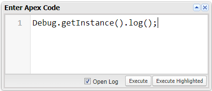
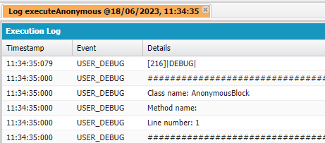

## <b id=''>What happened?</b>
<pre>
<b>1. Class name:</b> As the method was called from executed anonymous block (developer console), its name appeared in the log message.
<b>2. Method name:</b> As the method was called out of a method, nothing appeared in the method name.
<b>3. Line number:</b> As the method was called from the first line, the first line was showed in the log message.
</pre>

## <b id=''>Main methods</b>

### <b id=''>• log()</b>
<pre>
<b>→ Obs:</b> This method call a debug log message with basic information as showed above but, we will present it called from a simple class here.
</pre>
&emsp;<b>[Screen shoots]</b>
 &emsp;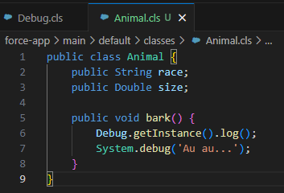
&emsp;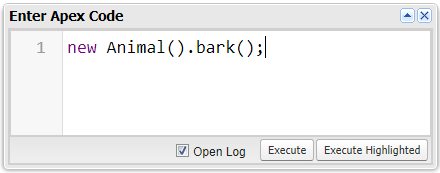
&emsp;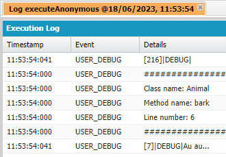
<pre>
<b>→ Explanation:</b> In the screen shoots above we can see the key points easily, as 'class name', 'method name', and 'line number', but it is the most simple sample here.
</pre>

### <b id=''>• log(Object key, Object value)</b>
<pre>
<b>→ Obs:</b> Here, we start to add some complexity to the debug logs. We can add lines, and this lines ('key → values') to see the result of some proccessment, or see what is happening insed the code.
<b>→ Obs²:</b> As the parameters are of type <b>Object</b>, it can accept any type of values, as SObject, maps, lists, and any other primitive or complex types.
</pre>
&emsp;<b>[Screen shoots]</b>
 &emsp;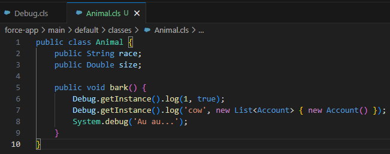
&emsp;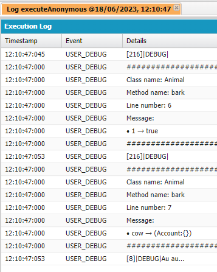
<pre>
<b>→ Explanation:</b>
1. The 'key' value is presented as an key in the message to identify the value you want to see.
2. The 'value' is presented to visualize what is saved inside the variable.
</pre>

### <b id=''>• log(Exception e)</b>
<pre>
<b>→ Obs:</b> This is my favorite one. Every dev format a exception message with his own pattern, what make the code different, and can add alot of lines to the project, but this method format the message with a single and easy pattern that help to undertand the key points.
</pre>
&emsp;<b>[Screen shoots]</b>
 &emsp;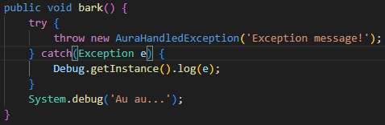
&emsp;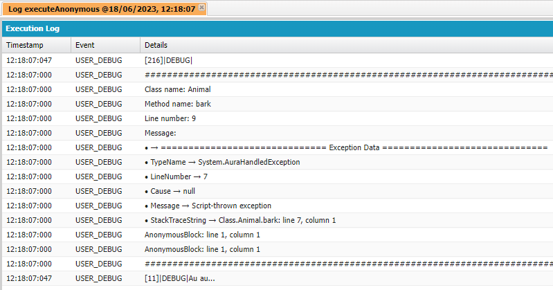
<pre>
<b>→ Explanation:</b>
1. In the message, a new section called 'Exception Data' is created, displaying what is important.
2. With this, we can implement exception log as simple, clear and fast as possible.
</pre>

### <b id=''>• log(Map<Object, Object> debugMap)</b>
<pre>
<b>→ Obs:</b> Passing a Map<Object, Object> , where the key map is the 'key' in the message, and the value map, is the 'value' in the message, we can log alot of values to see all we want easly.
</pre>
&emsp;<b>[Screen shoots]</b>
 &emsp;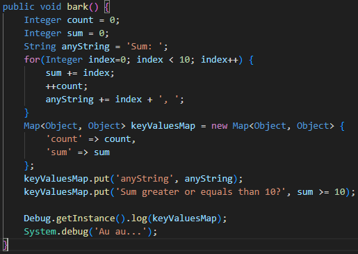
&emsp;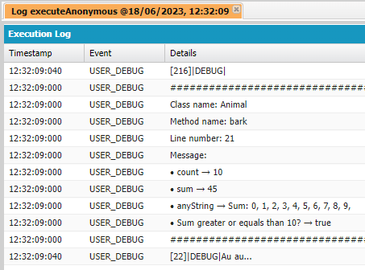
<pre>
<b>→ Explanation:</b> Every '• key → value' use a different line to be displayed.
</pre>

### <b id=''>• log(Map<Object, Object> debugMap, Exception e)</b>
<pre>
<b>→ Obs:</b> And we can combine the useful with the pleasant to present both the data that were used and the data of the exception generated to understand what happened.
</pre>
&emsp;<b>[Screen shoots]</b>
 &emsp;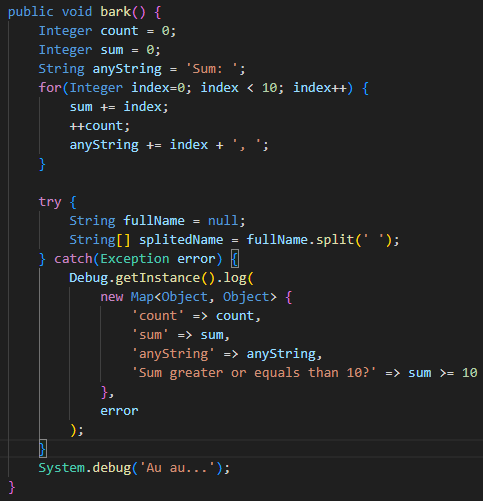
&emsp;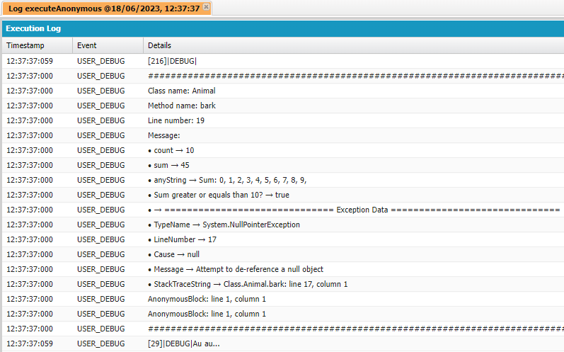
<pre>
<b>→ Explanation:</b> We can send at same time a key value map, with the exception threw to see everything easly.
</pre>

## <b id=''>Important details</b>
• Some times, we try to log long messages, that some times can be hidden by developer log, or the log itself when opened in a IDE or text editor, but with this class, i prepared a break line function to break long values message, using a <b>Regex expression</b>, based in line size, and that use a default <b>Break simbol</b>, that can be customized using a set method. By default:
<pre>
<b>→ The split character simbol:</b> A comma (,)
<b>→ The minimum and max size to break a line (a space to try to find a split character):</b> Min: 340 | Max: 400
<b>→ Default regex expression:</b> (?<=\\G.{340,400}),
</pre>

• You can use set methods to change custom settings: 
<text style="color: red;">
    <b>Warning: Be carefull! Some complex, and long strings with a long split lenght (min → max) can generate a 'to complex regex' exception.</b>
</text>
<pre>
<b>→ setMinSplitLenght</b>
<b>→ setMaxSplitLenght</b>
<b>→ setCharacterSplitSignal</b>
</pre>

• You can use a method to change the breakline to a serializiation, where the code stops to break line and convert the value to a JSON, where sometimes we can see all the line.
<pre>
<b>→ serializeLog</b>
</pre>

 • Every customization is reseted after the end of the proccess to log the data by a method inside the proccess called <b>'cleanInstanceVariables'</b>. So if you want to customize, you will need to change defaults again.

## <b id=''>Other methods</b>

### <b id=''>• start()</b>
<pre>
<b>→ Obs:</b> This method is used in the place of 'log()' method without parameters. The difference between this two methos is only a aditional message showed indicating that the method you want to analize is 'starting...'.
</pre>
&emsp;<b>[Screen shoots]</b>
 &emsp;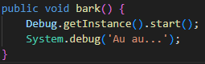
&emsp;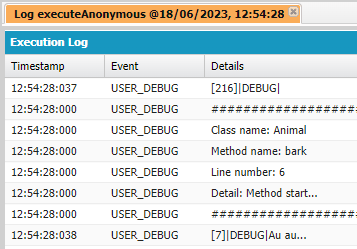
<pre>
<b>→ Explanation:</b> Add a aditional information saying the method analised is starting.
</pre>

### <b id=''>• end()</b>
<pre>
<b>→ Obs:</b> Equals to the start, but is used to be placed in the end of the method.
</pre>
&emsp;<b>[Screen shoots]</b>
 &emsp;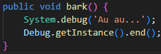
&emsp;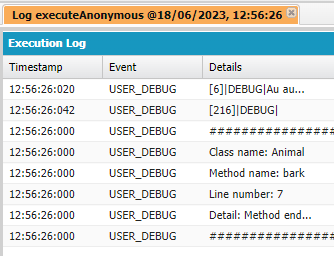
<pre>
<b>→ Explanation:</b> Add a aditional information saying the method analised is ending.
</pre>

### <b id=''>• setStart()</b>
<pre>
<b>→ Obs:</b> You can use 'setStart()' method to add this additional message in a more complex log, to analyse for example parameters that the method received and its values when starting the method.
</pre>
&emsp;<b>[Screen shoots]</b>
 &emsp;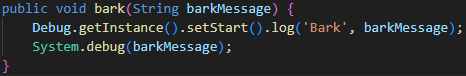
&emsp;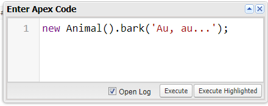
&emsp;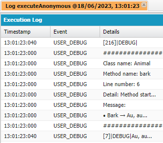
<pre>
<b>→ Explanation:</b> Add a aditional information to a more complex log, saying the method analised is starting.
</pre>

### <b id=''>• setEnd()</b>
<pre>
<b>→ Obs:</b> You can use 'setEnd()' method to add this additional message in a more complex log, to analyse for example parameters when the method is ending, and see what happened during proccessment.
</pre>
&emsp;<b>[Screen shoots]</b>
 &emsp;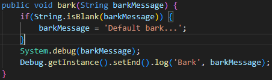
&emsp;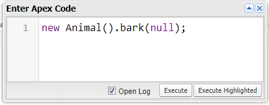
&emsp;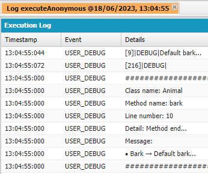
<pre>
<b>→ Explanation:</b> Add a aditional information to a more complex log, saying the method analised is ending.
</pre>

# Salesforce DX Project: Next Steps

Now that you’ve created a Salesforce DX project, what’s next? Here are some documentation resources to get you started.

## How Do You Plan to Deploy Your Changes?

Do you want to deploy a set of changes, or create a self-contained application? Choose a [development model](https://developer.salesforce.com/tools/vscode/en/user-guide/development-models).

## Configure Your Salesforce DX Project

The `sfdx-project.json` file contains useful configuration information for your project. See [Salesforce DX Project Configuration](https://developer.salesforce.com/docs/atlas.en-us.sfdx_dev.meta/sfdx_dev/sfdx_dev_ws_config.htm) in the _Salesforce DX Developer Guide_ for details about this file.

## Read All About It

- [Salesforce Extensions Documentation](https://developer.salesforce.com/tools/vscode/)
- [Salesforce CLI Setup Guide](https://developer.salesforce.com/docs/atlas.en-us.sfdx_setup.meta/sfdx_setup/sfdx_setup_intro.htm)
- [Salesforce DX Developer Guide](https://developer.salesforce.com/docs/atlas.en-us.sfdx_dev.meta/sfdx_dev/sfdx_dev_intro.htm)
- [Salesforce CLI Command Reference](https://developer.salesforce.com/docs/atlas.en-us.sfdx_cli_reference.meta/sfdx_cli_reference/cli_reference.htm)
